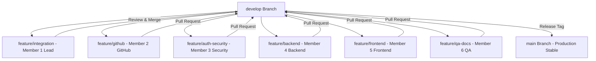

# SihFlow ERP — SIH 2026 Team Management System

[-blue.svg)]()
[]()
[]()
[]()
[-brightgreen.svg)]()

> **CRITICAL ARCHITECTURAL CONTEXT**:
> **SihFlow ERP is NOT the SIH solution itself.**
> 
> SihFlow ERP is the **INTERNAL PROJECT MANAGEMENT SYSTEM** used by our 6-member Smart India Hackathon team to plan, assign, track, review, test, and steer the development of our actual SIH hackathon project: **AcadShield** (`https://github.com/vishanth11/AcadShield.git` — SIH Problem Statement #1422: Tamper-proof academic credential verification leveraging decentralized blockchain ledgers).

---

## 🏗️ Monorepo Architecture

SihFlow ERP is engineered as a clean, decoupled monorepo enabling 6 developers to build in parallel with zero merge conflicts:

```
sihflow-erp/
├── apps/
│   ├── api/                      # Express + TypeScript + Prisma Modular REST API (/api/v1/*)
│   └── web/                      # React 18 + Vite + Tailwind CSS Light Theme SPA
├── packages/
│   ├── types/                    # Shared DTOs & TypeScript models (@sihflow/types)
│   ├── validation/               # Shared Zod validation schemas (@sihflow/validation)
│   └── config/                   # Shared constants & team roster (@sihflow/config)
├── prisma/
│   ├── schema.prisma             # 25+ PostgreSQL Relational Models (UUID, Indexes, Enums)
│   └── seed.ts                   # Comprehensive DB Seeding Script
├── docker/
│   ├── Dockerfile.api            # Multi-stage container for API
│   ├── Dockerfile.web            # Multi-stage NGINX container for SPA
│   └── nginx.conf                # Reverse proxy config
├── docs/                         # Full architectural & engineering documentation
│   ├── architecture.md           # High-level system architecture
│   ├── database.md               # PostgreSQL schema & data dictionary
│   ├── api.md                    # REST API v1 endpoint specifications
│   ├── git-workflow.md           # Git branching & PR merge policies
│   ├── team-workflow.md          # 6-member parallel execution workflow
│   ├── github-integration.md     # GitHub SCM telemetry integration
│   ├── security.md               # JWT, RBAC & threat modeling
│   ├── testing.md                # QA testing strategy & test suites
│   └── deployment.md             # Docker & local deployment guide
├── docker-compose.yml            # Multi-container local orchestration
└── .env.example                  # Environment variable template
```

---

## 👥 6-Member Team Roster & Assigned Branches

| Member | Role | Primary Responsibility | Dedicated Branch | Email |
| :--- | :--- | :--- | :--- | :--- |
| **Member 1** | **Team Lead** | Overall architecture, integration, Mission Control, PR reviews, live demo | `feature/integration` | `lead@sihflow.io` |
| **Member 2** | **GitHub / Activity** | GitHub API sync, commits, PRs, issues triage, contributor metrics | `feature/github` | `github@sihflow.io` |
| **Member 3** | **Security** | Authentication, JWT, RBAC, W3C DIDs, tamper detection schemas | `feature/auth-security` | `security@sihflow.io` |
| **Member 4** | **Backend** | PostgreSQL, Prisma, REST APIs, tasks, milestones, sprints, blockers | `feature/backend` | `backend@sihflow.io` |
| **Member 5** | **Frontend** | React 18 UI, light-theme design system, Kanban board, activity feed | `feature/frontend` | `frontend@sihflow.io` |
| **Member 6** | **QA / UI-UX / Docs** | Vitest test suites, bug tracking, SRS v1.0 docs, SIH readiness index | `feature/qa-docs` | `qa@sihflow.io` |

*Universal Demo Account Password*: `Demo@123`

---

## 🌿 Git Branching Strategy



- `main` = Production stable releases.
- `develop` = Continuous integration branch.
- Feature branches merge into `develop` via PRs reviewed and approved by Team Lead or QA Reviewer.

---

## 🚀 Quick Start & Local Setup

### 1. Install Dependencies
```bash
npm install
```

### 2. Build Shared Packages
```bash
npm run build -w @sihflow/types
npm run build -w @sihflow/validation
npm run build -w @sihflow/config
```

### 3. Database Initialization (PostgreSQL + Prisma)
```bash
# Push database schema
npx prisma db push

# Run seed script
npx prisma db seed
```

### 4. Run Development Servers
```bash
# Start Backend API (Port 5000)
npm run dev -w @sihflow/api

# Start Frontend Client (Port 5173)
npm run dev -w @sihflow/web
```

---

## 🐳 Docker Deployment

To spin up PostgreSQL, the Backend API, and the Frontend NGINX web server with a single command:

```bash
docker-compose up -d --build
```

- **Web Client**: `http://localhost`
- **Backend API**: `http://localhost:5000/api/v1`
- **Health Check**: `http://localhost:5000/api/v1/health`

---

## 🧪 Verification & Test Suite

Run the automated Vitest test suite:
```bash
npm test -w @sihflow/api
```

Verifies:
- `GET /api/v1/health` status response
- Authentication & JWT generation
- Unauthorized 401 error envelope
- AcadShield project & workstream data
- 6-member team roster validation
- Task creation and status lifecycle
- Milestones M1–M11 roadmap gates
- Blocker reporting and resolution
- 14-parameter SIH readiness score calculation
- Team Lead mission control telemetry aggregation
