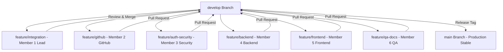

# SihFlow ERP — System Architecture Specification

## 1. Executive Summary & Objective

**SihFlow ERP** is an internal, production-grade project management and mission control system engineered specifically for a 6-member Smart India Hackathon (SIH) team developing **AcadShield** (SIH Problem Statement #1422 — Decentralized Academic Credential Verification System).

> **Important Boundary Rule**: SihFlow ERP is **NOT** the SIH project itself. SihFlow ERP is the dedicated operational ERP used to plan, assign, track, review, test, and steer the development of AcadShield.

---

## 2. Monorepo Architecture Overview

SihFlow ERP is organized as a high-performance npm workspace monorepo:

```
sihflow-erp/
├── apps/
│   ├── api/                      # Node.js + Express + TypeScript + Prisma REST API
│   │   ├── src/
│   │   │   ├── config/           # Database & Environment Configuration
│   │   │   ├── middleware/       # JWT Auth, RBAC, Validation & Error Handlers
│   │   │   ├── modules/          # 18 Modular Domain Handlers (Tasks, Sprints, Blockers...)
│   │   │   ├── integrations/     # GitHub API & External Providers
│   │   │   ├── routes/v1/        # Versioned Routing Hub (/api/v1/*)
│   │   │   └── tests/            # Vitest Integration Test Suites
│   │   └── dist/                 # Production compiled JavaScript
│   └── web/                      # React 18 + TypeScript + Vite + Tailwind CSS SPA
│       ├── src/
│       │   ├── api/              # Axios HTTP client with JWT interceptor
│       │   ├── components/       # Reusable Light Theme UI Components
│       │   ├── pages/            # 20+ Light Theme SaaS Management Views
│       │   ├── stores/           # AuthContext & State Management
│       │   └── styles/           # Tailwind CSS Base & Theme Tokens
├── packages/
│   ├── types/                    # Shared TypeScript interfaces & DTOs (@sihflow/types)
│   ├── validation/               # Shared Zod schemas (@sihflow/validation)
│   └── config/                   # Shared constants & team roster (@sihflow/config)
├── prisma/
│   ├── schema.prisma             # 25+ Relational PostgreSQL tables & Enums
│   └── seed.ts                   # Comprehensive DB Seeding Script
├── docker/
│   ├── Dockerfile.api            # Multi-stage production container for API
│   ├── Dockerfile.web            # Multi-stage NGINX container for SPA
│   └── nginx.conf                # Reverse proxy configuration
├── docs/                         # Comprehensive Engineering Documentation
└── docker-compose.yml            # Multi-container local orchestration
```

---

## 3. Layered Architectural Stack

| Layer | Technology | Key Responsibility |
| :--- | :--- | :--- |
| **Presentation** | React 18, Vite, Tailwind CSS, Lucide Icons | Clean light-theme UI, Mission Control, Kanban board, SIH Readiness matrix |
| **API Gateway** | Express.js, TypeScript, Morgan, CORS | Versioned REST endpoints (`/api/v1/*`), request rate-limiting, error envelope |
| **Shared Core** | `@sihflow/types`, `@sihflow/validation` | Strong typing, zero-redundancy schemas, end-to-end request validation |
| **Data Access** | Prisma ORM 5.x, PostgreSQL 16 | Relational data persistence, foreign key constraints, connection pooling |
| **Automation** | Vitest, Supertest, Docker Compose | Automated integration tests, local isolated service orchestration |

---

## 4. 6-Member Responsibilities & Branch Isolation

To achieve zero-merge-conflict parallel execution across all 6 developers:



1. **Member 1 (Team Lead / Integration)**: System architecture, integration, Mission Control dashboard, PR reviews, live demo rehearsal.
2. **Member 2 (GitHub / Developer Activity)**: GitHub API sync, webhook processor, commit tracking, PR analytics.
3. **Member 3 (Authentication / Security)**: JWT sessions, RBAC middleware, security audit logs, DID cryptographic schemas.
4. **Member 4 (Backend / Database)**: PostgreSQL schemas, Prisma data models, REST endpoints, task/sprint/blocker engines.
5. **Member 5 (Frontend)**: React 18 SPA, light theme SaaS UI, interactive Kanban board, real-time activity stream.
6. **Member 6 (QA / UI-UX / Documentation)**: Automated test suites (Vitest/Supertest), bug tracking, SRS v1.0 docs, SIH readiness index.
