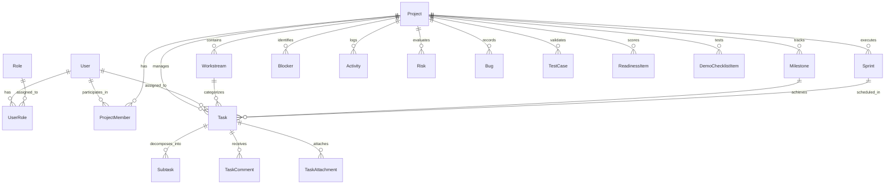

# SihFlow ERP — Database Schema & Data Dictionary

## 1. Overview

SihFlow ERP uses **PostgreSQL 16** managed via **Prisma ORM**. The schema consists of **25+ normalized relational tables** utilizing UUID primary keys, foreign key constraints, indexes on query paths, and soft deletion flags.

---

## 2. Entity Relationship Map (Core Entities)



---

## 3. Data Dictionary Summary

### 1. Identity & RBAC
- **`users`**: Team member credentials, profile data, assigned team roles, GitHub usernames, and active status.
- **`roles`**: System permissions (`TEAM_LEAD`, `TEAM_MEMBER`, `REVIEWER`, `ADMIN`).
- **`user_roles`**: Many-to-many junction linking users with system roles.

### 2. Project Hierarchy
- **`projects`**: Top-level project entity (`AcadShield`), SIH problem statement number (#1422), objective, status, progress.
- **`project_members`**: Member participation matrix with specific project responsibilities.
- **`workstreams`**: 17 dedicated SIH workstreams (WS-01 through WS-17).
- **`milestones`**: 11 delivery milestones (M1 through M11) with deadlines and progress metrics.
- **`sprints`**: Timeboxed development sprints (Sprint 1, 2, 3) with velocity targets and burn-up stats.

### 3. Work Management
- **`tasks`**: Technical work units with custom string IDs (`TASK-101`), priorities, statuses, assignee, workstream, and milestone links.
- **`subtasks`**: Atomic checklist items within a task.
- **`task_comments`**: Collaboration commentary per task.
- **`blockers`**: Impediment registry (`BLK-001`) with reporter, blocked user, priority, impact, and resolution timestamps.

### 4. Code & Assurance
- **`activities`**: Extensible audit logging stream recording all CRUD and state change operations.
- **`meetings`**: Standup and architecture sync logs with 1-click task conversion.
- **`documents`**: Software Requirements Specifications (SRS), architecture notes, and approval states.
- **`risks`**: Risk probability and impact matrix with proactive mitigation strategies.
- **`bugs`**: Defect tracker (`BUG-001`) with severity ratings and reproduction steps.
- **`test_cases`**: Vitest/Supertest QA automated test cases and execution time records.
- **`readiness_items`**: 14 SIH Grand Finale evaluation benchmarks.
- **`demo_checklist_items`**: 5 live jury demo scenarios with expected outputs.
- **`github_repositories`**, **`github_commits`**, **`github_pull_requests`**: SCM tracking.

---

## 4. Seeding & Migration Commands

```bash
# Push database schema to PostgreSQL
npx prisma db push

# Execute database seed
npx prisma db seed

# Open Prisma Studio GUI
npx prisma studio
```
