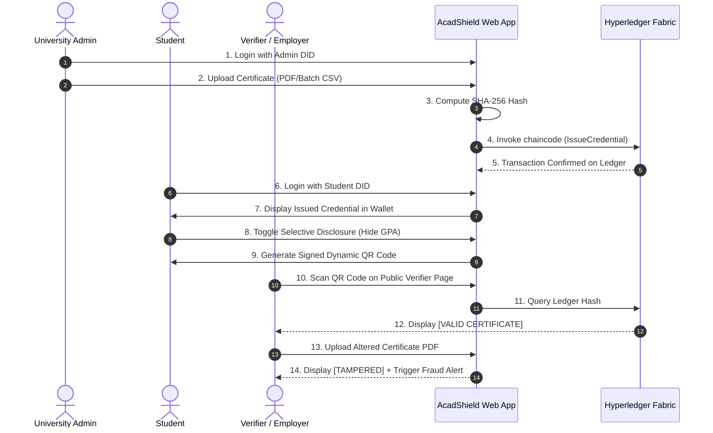

# SihFlow ERP — Live Demo Execution Guide (14 Scenarios)

## 1. Live Demonstration Checklist

The live demonstration of **AcadShield** follows an exact 14-step script to guarantee maximum jury impact:

---

## 2. 14 Demonstration Scenarios

1. **Student Login**: Login via Student DID (`did:acadshield:stud-001`) and password.
2. **Institution Login**: Login via University Registrar DID (`did:acadshield:inst-001`).
3. **Verifier Access**: Open public verification portal without requiring authentication.
4. **Issue Credential Flow**: Upload single degree PDF and batch CSV for 100 students.
5. **SHA-256 Hash Generation**: Verify cryptographic hash matches file payload locally.
6. **Hyperledger Fabric Commit**: Emit transaction to peers with transaction ID.
7. **Storage Adapter**: Store credential metadata and encrypted PDF in storage service.
8. **Student Wallet View**: View issued B.Tech Degree certificate in student wallet.
9. **Signed QR Code**: Render SVG QR Code with digitally signed token.
10. **Selective Disclosure**: Toggle "Hide Marks / Show Degree Only" with ZKP proof.
11. **Instant Verification (Valid)**: Scan QR code -> Instant green `VALID` badge.
12. **Tampering Detection (Tampered)**: Modify 1 byte of PDF -> Instant red `TAMPERED` badge.
13. **Revocation Check (Revoked)**: University marks degree revoked -> Instant `REVOKED` badge.
14. **Fraud Alert Engine**: Tampered attempt is logged with IP address and geolocation.
