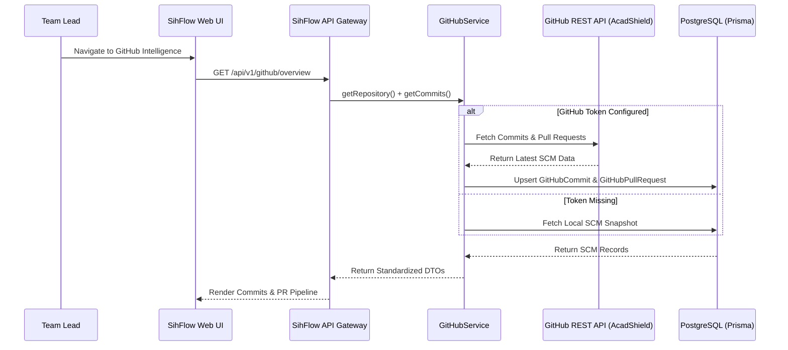

# SihFlow ERP — GitHub Integration Architecture

## 1. Overview & Security Isolation

SihFlow ERP includes a dedicated backend integration layer for tracking development activity on the target **AcadShield** repository (`https://github.com/vishanth11/AcadShield.git`).

### Security Rule:
- **Zero Frontend Exposure**: GitHub personal access tokens or OAuth secrets are strictly stored in backend environment variables (`GITHUB_TOKEN`) and are **never** exposed to the client bundle.
- **Graceful Fallback**: If no GitHub token is provided in `.env`, the system automatically serves verified local repository snapshot metrics without breaking the UI.

---

## 2. GitHub Service Abstraction (`IGitHubService`)

Located at: `apps/api/src/integrations/github/github.service.ts`

```typescript
export interface IGitHubService {
  getRepository(projectId: string): Promise<any>;
  getCommits(projectId: string, limit?: number): Promise<any[]>;
  getPullRequests(projectId: string, status?: string): Promise<any[]>;
  getIssues(projectId: string, state?: string): Promise<any[]>;
  getReviews(prId: string): Promise<any[]>;
  getContributors(projectId: string): Promise<any[]>;
  syncRepository(projectId: string): Promise<{ synced: boolean; message: string }>;
}
```

---

## 3. Telemetry Sync Model


